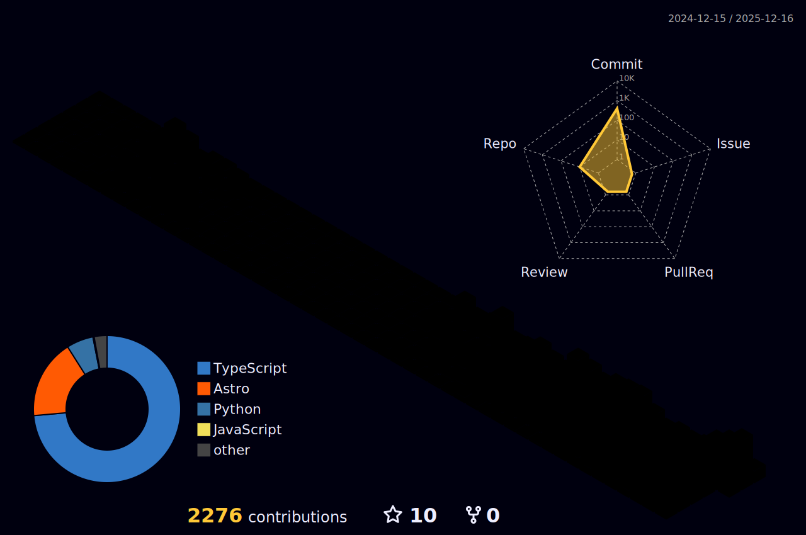

  
  
  <h1>Hi there, I'm Alexander Gonzalez! </h1>
  
  

    <b>Computer Science Student & Web Developer</b>
  

  
  
  

 

### 👨‍💻 About Me

- 🎓 I'm currently pursuing a **Bachelor's Degree in Computer Science** at Universidad de Oriente (Expected graduation: Mid-2025).
- 💻 My core focus is **Web Development** (MERN Stack & PHP). I love building scalable and user-friendly applications.
- 🌐 I am constantly learning via University, FreeCodeCamp, Coursera, and documentation.
- 🌱 Currently exploring **Technical Content Writing** and Advanced React Patterns.
- ⚡ **Fun fact:** When I'm not coding, I enjoy dancing Salsa and Bachata! 🎵

---

### 🛠️ Tech Stack & Tools

  
    
  

---

### 🏙️ 3D Contribution City

  

---

### 🐍 Contribution Activity

  <picture>
    <source media="(prefers-color-scheme: dark)" srcset="https://raw.githubusercontent.com/AlexMGP7/AlexMGP7/output/github-contribution-grid-snake-dark.svg">
    <source media="(prefers-color-scheme: light)" srcset="https://raw.githubusercontent.com/AlexMGP7/AlexMGP7/output/github-contribution-grid-snake.svg">
    
  </picture>

### 📊 GitHub Analytics

  
  

---

### ✍️ Latest Blog Posts

- [100 Days Coding Challenge - Day 30: FreeCodeCamp Front End Development Libraries](https://dev.to/alexmgp7/100-days-coding-challenge-day-30-freecodecamp-front-end-development-libraries-47p6)
- [100 Days Coding Challenge - Day 29: PHP &amp; MySql Login page](https://dev.to/alexmgp7/100-days-coding-challenge-day-29-php-mysql-login-page-3dg4)
- [100 Days Coding Challenge - Day 28: FreeCodeCamp JavaScript Algorithms and Data Structures Certification](https://dev.to/alexmgp7/100-days-coding-challenge-day-28-freecodecamp-javascript-algorithms-and-data-structures-certification-3268)
- [100 Days Coding Challenge - Day 26: FreeCodeCamp JavaScript Algorithms and Data Structures](https://dev.to/alexmgp7/100-days-coding-challenge-day-27-freecodecamp-javascript-algorithms-and-data-structures-276k)
---

  
   
  <i>Let's connect and build something amazing together!</i>

